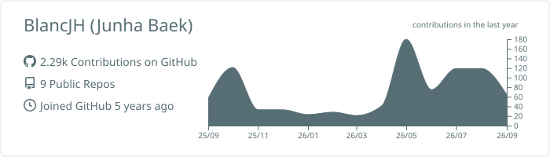
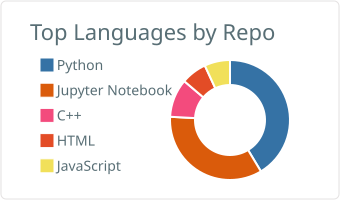
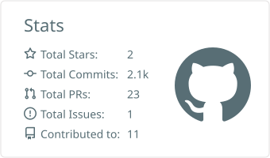
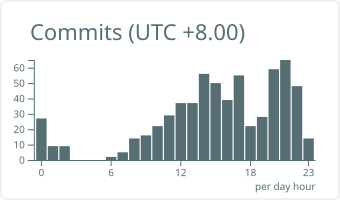

Junha Baek

Robotics · Computer Vision · Artificial Intelligence

Building practical autonomous systems that perceive, navigate and interact with the real world.

<a href="#about">ABOUT</a> · <a href="#toolkit">TOOLKIT</a> · <a href="#featured-projects">PROJECTS</a> · <a href="#github-activity">ACTIVITY</a>

About

<table>
<tr>
<td width="58%" valign="top">
<h3>Building at the intersection of robotics and AI</h3>

I am focused on autonomous robotics, computer vision and intelligent systems. My work and projects explore how robots can understand complex environments, make useful decisions and operate reliably beyond controlled laboratory settings.

My current technical interests include:

<ul>
<li>Visual and LiDAR-based perception</li>
<li>SLAM and autonomous navigation</li>
<li>Reinforcement learning for robot control</li>
<li>Robotics simulation and sim-to-real workflows</li>
</ul>
</td>
<td width="42%" valign="top">
<h3>Current direction</h3>
<pre><code>focus: autonomous robotics
studying: Master of AI
exploring:
  - perception
  - navigation
  - reinforcement learning
location: Perth, Australia</code></pre>
</td>
</tr>
</table>

Toolkit

Robotics and AI

Simulation and development

Featured Projects

<table>
<tr>
<td width="33%" valign="top">
<h3><a href="https://github.com/BlancJH/carla-mining-haulage-truck-yolopv2">Mining Haulage Perception</a></h3>

Vision-based road and environment perception for autonomous mining haulage vehicles in CARLA.

<a href="https://github.com/BlancJH/carla-mining-haulage-truck-yolopv2">View repository →</a>
</td>
<td width="33%" valign="top">
<h3><a href="https://github.com/BlancJH/steel-defect-classification">Steel Defect Detection</a></h3>

Deep-learning workflow for detecting and classifying defects on industrial steel surfaces.

<a href="https://github.com/BlancJH/steel-defect-classification">View repository →</a>
</td>
<td width="33%" valign="top">
<h3><a href="https://github.com/BlancJH/microduck_rl">MicroDuck RL</a></h3>

Reinforcement-learning experiments for navigation and control of a compact robotic platform.

<a href="https://github.com/BlancJH/microduck_rl">View repository →</a>
</td>
</tr>
</table>

<strong>More projects</strong>

 

Tello Steel Defect Detection — aerial inspection and computer vision

MicroDuck — compact robotics platform development

BLEVE Prediction — machine-learning prediction and analysis

Neural Network Hyperparameters — neural-network experimentation

GitHub Activity

 

 

Build. Test. Learn. Repeat.

Developing the skills to build robots that work outside the laboratory.

